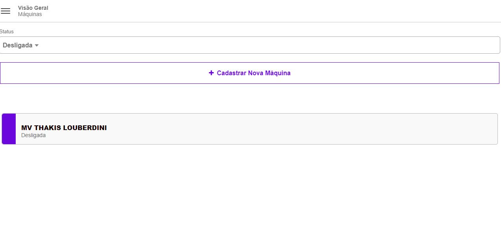

# Dashboard Macchines - Backend
Aplicação de Cadastro e Consulta de Máquinas

<h1 align="center">
  
</h1>


## 💻 Tecnologias Utilizadas nesse Projeto
<div style="display: inline_block">
  
  
</div>

<br>

## Especificações
- Node: 20.17.0
- Pacote de Gerenciamento de Dependências: NPM
- Framework: NestJS
- Deploy: Render
- Link Deploy: https://dashboard-macchines-backend.onrender.com/doc

<br>

## Como instalar as dependências
```bash
$ npm install
```

<br>

## Rodar o Projeto
```bash
$ npm run dev
```